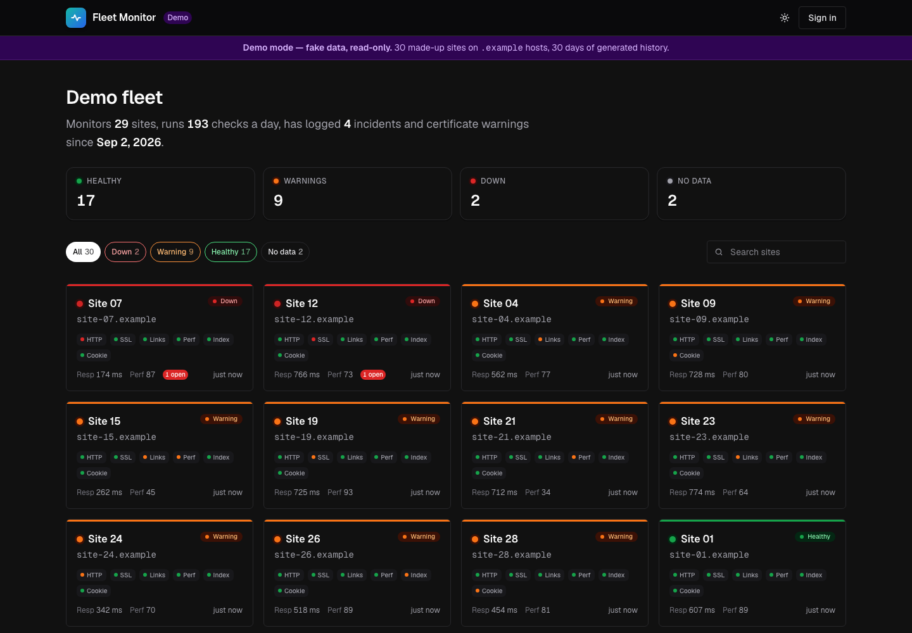
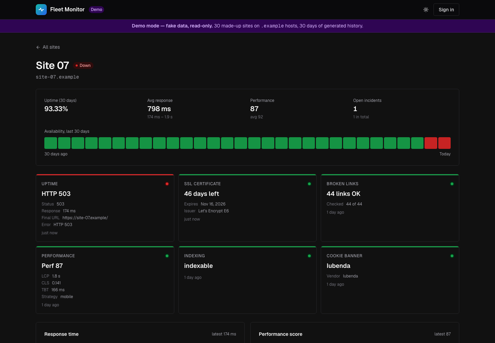
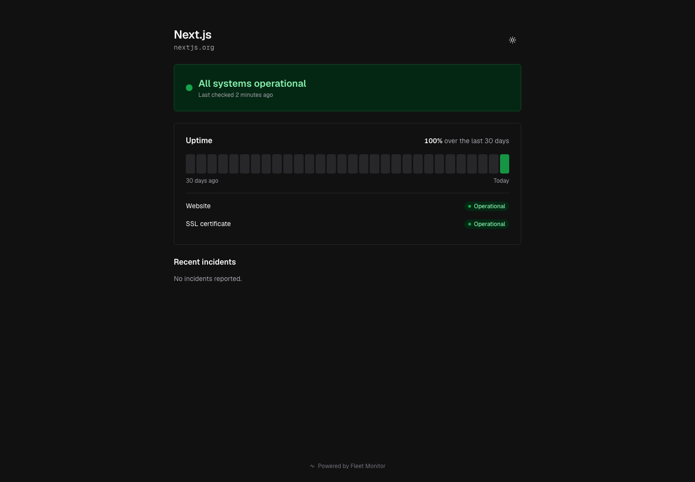
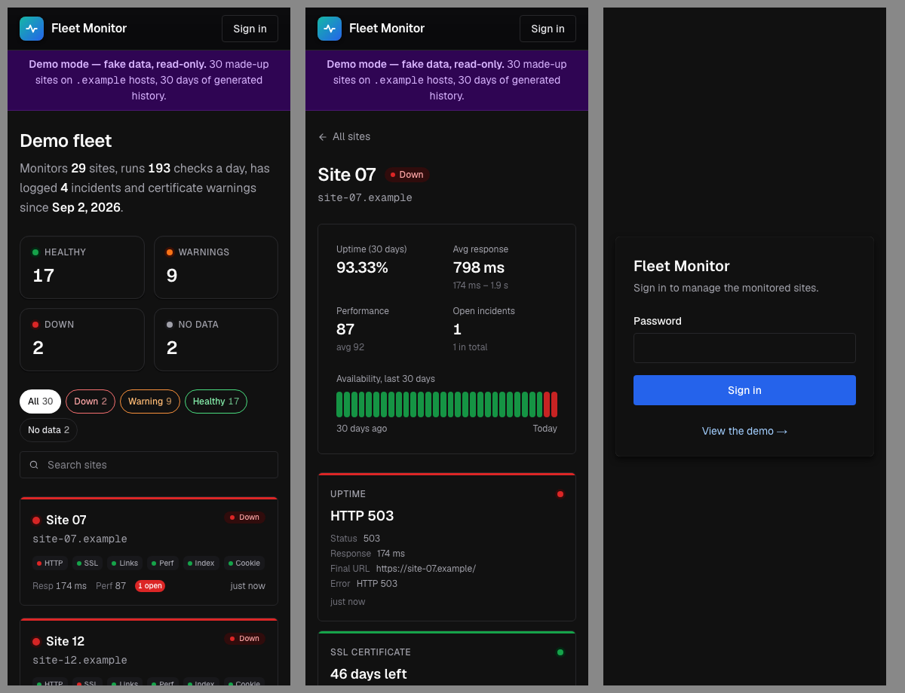

# Fleet Monitor



Uptime, SSL expiry, broken links, Lighthouse scores, `noindex` and cookie-banner checks for a fleet of websites, with 30 days of history, incidents, email alerts and a public status page per site.

**Live demo:** `/demo` (no login, fake data). **The number:** _"Monitors N sites, runs M checks a day, has logged K incidents and certificate warnings since &lt;date&gt;"_ is computed from the database and shown in the dashboard header.

## Why

I look after a fleet of about 50 client WordPress sites and had already built tooling to fix them in bulk: a remote-controlled plugin that applies noindex, favicon and cookie-consent fixes across the whole fleet. What it did not have was visibility over time. Certificates expired silently, a site would quietly start serving `noindex`, homepage links rotted, and I usually found out when a client did. Fleet Monitor is the outside-in half: it checks every site once a day from the visitor's side, keeps the history, opens incidents and emails me before anyone else notices. This public version watches well-known public sites instead of client sites.

## Screenshots

| Site detail | Public status page | Mobile (375 px) |
| --- | --- | --- |
|  |  |  |

## Run it

```bash
pnpm install
cp .env.example .env.local        # set ADMIN_PASSWORD, SESSION_SECRET, CRON_SECRET

# Postgres: either Docker...
docker compose up -d
# ...or a real Postgres from npm, no Docker needed (keep it running in its own terminal)
pnpm db:local

pnpm db:migrate
pnpm db:seed                      # ~25 well-known public sites
pnpm dev                          # http://localhost:3000  (/demo needs no database rows)
```

Sign in with `ADMIN_PASSWORD`, press **Run checks now**, or trigger the cron route yourself:

```bash
curl -H "Authorization: Bearer $CRON_SECRET" http://localhost:3000/api/cron
```

Tests: `pnpm test` (Vitest, 170+ tests; the DB-backed suites run when `TEST_DATABASE_URL` points at a throwaway database and are skipped otherwise). Also `pnpm typecheck`, `pnpm lint`.

Optional keys: `RESEND_API_KEY` + `ALERT_FROM` + `ALERT_TO` for alert emails, `PAGESPEED_API_KEY` for Lighthouse scores. Without them those features are skipped and everything else works.

## Architecture

- **Next.js 16 (App Router) on Vercel, Chakra UI v3, Neon Postgres + Drizzle.** Three tables: `sites`, `checks (site_id, kind, ran_at, ok, latency_ms, data jsonb)`, `incidents (site_id, kind, opened_at, closed_at)`.
- **Checks are plain functions** in `lib/checks/*.ts`, each returning `{ ok, latency_ms, data }` and unit-tested against fixtures with injected `fetch`/TLS: HTTP status and response time (GET, not HEAD: some WordPress hosts reject HEAD; 403/429 count as "blocked", not down), SSL expiry and trust via `tls.connect`, same-origin homepage links (max 50, concurrency 5), PageSpeed Insights performance, `noindex` in meta or `X-Robots-Tag`, and known consent tools in the HTML. The homepage is fetched once and shared by the last three.
- **Scheduling: one Vercel Cron a day** (`0 6 * * *`) calls `/api/cron`, protected by `CRON_SECRET`. PageSpeed runs in its own lane in parallel with the fast checks, and a deadline guard keeps the run inside `maxDuration`. No queue, no Redis.
- **Incidents without flapping:** a transient HTTP or SSL failure (timeout, 5xx, connection error) is retried once in the same run and only opens an incident if it fails twice in a row. A definitive failure (a 404, a certificate under 14 days) opens one straight away. Recovery closes it. Each open/close is decided under a per-site Postgres advisory lock, so a double-fired cron cannot open duplicates. Resend emails on open and on close.
- **Auth and public surfaces:** one admin password, an HMAC-signed session cookie checked in `proxy.ts`, and a login rate limiter. `/demo` renders the real dashboard components from a deterministic fake fleet (`site-01.example`...). `/status/[slug]` gets a narrowed view model, so no admin data reaches the public payload.

## Decisions worth noting

- **Daily, not every 10 minutes.** Vercel Hobby crons run once a day. The in-run retry filters out blips without waiting a second day, and the admin "Run checks now" button covers the urgent case.
- **SSL check reads the certificate even when it is invalid** (`rejectUnauthorized: false`) so it can report days left on an expired cert, then marks wrong-host, self-signed and untrusted chains as down.
- **Broken links, noindex, missing cookie banner and low performance are warnings, never incidents.** Only HTTP and SSL page me.

## What I'd do next

- Telegram or Slack alerts next to email.
- Move the runner to a Fly.io machine with `node-cron` (same code) for a 10-minute cadence.
- Per-site check schedules and maintenance windows.
- Run PageSpeed from both mobile and desktop strategies and track Core Web Vitals separately.
- Weekly digest email: new warnings, certificates expiring within 30 days, performance regressions.
